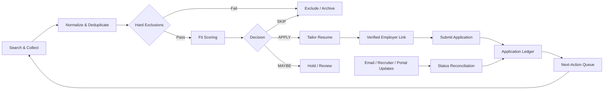

# CareerOps Agent

CareerOps Agent is an AI-assisted career intelligence workflow for discovering, deduplicating, scoring, tracking, and preparing applications for high-fit technical roles.

Rather than treating job search as a one-shot prompt, the project models it as a repeatable operating system:

1. **Search & collect** current openings from multiple sources.
2. **Deduplicate & normalize** overlapping postings.
3. **Evaluate fit** with explicit scoring criteria and hard exclusions.
4. **Prepare applications** with role-specific resume guidance and verified apply links.
5. **Track state** across applications, interviews, assessments, rejections, and withdrawals.
6. **Reconcile communications** without inferring rejection from silence.
7. **Iterate continuously** as preferences, market conditions, and application status change.

> **Privacy note:** This public repository contains no credentials, private email content, recruiter conversations, resumes, or real application-history data. Examples are synthetic.

## Why this project exists

Most job-search automations stop at scraping listings. CareerOps focuses on the harder system-design problems around the search:

- How do you rank opportunities against a candidate's actual direction, not just keyword overlap?
- How do you prevent duplicate effort across LinkedIn, Indeed, employer sites, and alerts?
- How do you reconcile stale automated emails with higher-authority recruiter or portal status?
- How do you preserve truthful career history while tailoring a resume to each role?
- How do you turn an AI assistant into a governed decision-support workflow rather than an opaque recommendation engine?

## Workflow



## Search funnel

Each run should expose the funnel instead of only showing the final recommendations:

```text
Raw postings reviewed
        ↓
Unique postings after dedupe
        ↓
Plausible senior-level matches
        ↓
Fully evaluated opportunities
        ↓
APPLY / MAYBE / SKIP
```

This makes the breadth and selectivity of the search auditable.

## Fit model

The default weighted fit model is:

| Dimension | Weight |
|---|---:|
| Platform / technical alignment | 25% |
| Architecture alignment | 20% |
| Seniority / scope | 15% |
| Relevant domain experience | 10% |
| Compensation | 10% |
| Location / work arrangement | 10% |
| Interview probability | 5% |
| Career-direction alignment | 5% |

Hard exclusions run **before** scoring. Examples include an exact requisition already applied to, an exact requisition already rejected, a user-blacklisted employer, a clearance requirement the candidate cannot meet, or compensation below a configured floor.

See [docs/scoring-methodology.md](docs/scoring-methodology.md).

## Repository layout

```text
CareerOps-Agent/
├── README.md
├── LICENSE
├── pyproject.toml
├── config/
│   └── candidate-profile.example.yaml
├── docs/
│   ├── architecture.md
│   ├── scoring-methodology.md
│   └── workflow.md
├── examples/
│   ├── sample-application-ledger.json
│   ├── scoring-output.json
│   └── synthetic-job-input.json
├── prompts/
│   ├── application-tracking.md
│   ├── fit-evaluation.md
│   ├── gmail-reconciliation.md
│   ├── job-discovery.md
│   └── resume-tailoring.md
├── schemas/
│   ├── application.schema.json
│   ├── candidate.schema.json
│   └── job.schema.json
├── src/
│   └── careerops/
│       ├── __init__.py
│       ├── dedupe.py
│       ├── ledger.py
│       ├── scoring.py
│       └── workflow.py
└── tests/
    ├── test_dedupe.py
    └── test_scoring.py
```

## Design principles

### Human in the loop
CareerOps recommends and prepares. The candidate remains the decision-maker for applications, resume truthfulness, recruiter communication, and interview participation.

### Source authority
When statuses conflict, a higher-authority source wins. The default precedence is:

```text
user-confirmed / recruiter-confirmed
    > employer portal
    > employer automated email
    > job-board automation
    > inferred state
```

Silence never becomes a rejection.

### Exact requisition deduplication
A rejection or submission excludes the **exact requisition**, not every job at that company.

### Truthful tailoring
Resume tailoring changes emphasis, ordering, and vocabulary; it does not rewrite history, invent skills, alter dates, or manufacture outcomes.

### Architecture-aware ranking
The system can weight solution architecture and data-platform work above pure implementation while still surfacing compelling Staff/Principal engineering opportunities.

## Quick start

Requires Python 3.11+.

```bash
python -m venv .venv
source .venv/bin/activate   # Windows: .venv\Scripts\activate
pip install -e ".[dev]"
pytest
```

Example scoring:

```python
from careerops.scoring import FitInputs, score_fit

result = score_fit(
    FitInputs(
        technical_alignment=95,
        architecture_alignment=90,
        seniority_scope=90,
        domain_alignment=80,
        compensation=90,
        location=100,
        interview_probability=75,
        career_direction=95,
    )
)

print(result.score)
print(result.decision)
```

## Prompt architecture

The prompt templates under [prompts/](prompts/) are intentionally modular:

- **Discovery** finds current opportunities and records source metadata.
- **Evaluation** scores and explains fit without padding weak roles.
- **Tracking** maintains the state ledger.
- **Communication reconciliation** applies source-authority rules.
- **Resume tailoring** creates role-specific emphasis while preserving factual history.

They are templates, not a dump of private conversation history.

## Future roadmap

- Provider adapters for job boards and employer career sites
- Pluggable email / calendar connectors
- Persistent SQLite or Postgres application ledger
- Resume document renderer
- Configurable scoring profiles by career direction
- CLI and lightweight web dashboard
- Scheduled delta scans
- Evaluation telemetry: interview rate by score band and source
- LLM-independent deterministic checks for exclusions and status precedence

## Disclaimer

CareerOps is a portfolio/reference implementation. Job postings, compensation, hiring status, and application outcomes change frequently and should be verified against authoritative employer sources before action.
