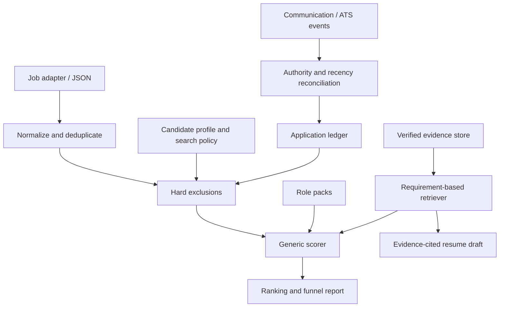

# CareerOps Agent

[](https://github.com/colbye03/CareerOps-Agent/actions/workflows/test.yml)

A candidate-specific career intelligence engine with configurable role packs, grounded evidence retrieval, explainable scoring, and an application event ledger. Career-specific vocabulary and weights live in data files, not engine branches.

The runnable reference implementation is local-first and deterministic. It demonstrates orchestration and the retrieval boundary without requiring an LLM, vector database, credentials, or a paid job feed. All included personas, jobs, evidence, and status examples are synthetic. It does not submit applications, send communications, access email, or modify a ChatGPT job-search workflow.

## Run the product

Python 3.11+:

```bash
python -m venv .venv
source .venv/bin/activate # Windows: .venv\Scripts\activate
pip install -e '.[dev]'
careerops init --persona data-cloud-architect
careerops run
careerops jobs
careerops explain JOB_ID
careerops resume JOB_ID
careerops ledger --job-id JOB_ID --status applied
careerops ledger
python -m pytest -q
```

Use an ID from `careerops jobs`. `resume` writes a Markdown evidence draft with citations and gaps; it is not a finished chronological resume. Recommendations never become application records automatically. Recording an application explicitly excludes that exact job on the next run.

A separate persona needs a separate workspace:

```bash
careerops --workspace /tmp/tpm-demo init --persona technical-program-manager
careerops --workspace /tmp/tpm-demo run
careerops --workspace /tmp/infra-demo init --persona infrastructure-architect
careerops --workspace /tmp/infra-demo run
```

The default workspace is `.careerops/`. Edit `candidate.json`, `evidence.json`, and `role-packs/*.json` there to configure your own career. `careerops run --jobs jobs.json` ingests an array conforming to [the job contract](schemas/job.schema.json). Init refuses to overwrite an existing workspace and adds a workspace-level ignore file. Keep private workspaces outside a public repository; ignore rules are a convenience, not a privacy guarantee.

## Architecture



| Component | Responsibility |
|---|---|
| Generic engine | Ingest, normalize, dedupe, exclude, score, rank and report |
| Candidate profile | Target packs, declared skills and held clearances |
| Evidence store | Structured achievements, projects, skills, metrics, proficiency and provenance |
| Role pack | Title aliases, competency dimensions, weights, requirement terms and expected proficiency |
| Search policy | Work arrangements, geography, comparable salary floor and decision thresholds |
| Hard exclusions | Employer/term exclusions, missing clearance, application state and policy constraints |
| Fit scoring | Candidate evidence coverage of recognized job requirements, with dimension-level explanations |
| Application ledger | Explicit status events, separate from job recommendations |
| Reconciliation | Normalized communication/ATS metadata, source authority, timestamp and idempotency |
| Resume retrieval | Verified facts selected for a job, with evidence IDs and provenance |
| Search funnel | Raw → unique → plausible → evaluated; exclusions and APPLY/MAYBE/SKIP totals |

## Nine starter role packs

Pack files ship under [`src/careerops/resources/role-packs/`](src/careerops/resources/role-packs/).

| Pack | Core competencies |
|---|---|
| Data Platform Architect | Platforms, governance, integration, architecture leadership |
| Solution Architect | Design, cloud, security, stakeholder strategy |
| Infrastructure Architect | Cloud infrastructure, networking, IAM/security, IaC, resiliency/DR, Kubernetes, observability, architecture leadership |
| Data Engineer | Pipelines, processing, modeling, reliability, delivery |
| AI Engineer | LLM/RAG implementation, agents, retrieval, operations, safety |
| AI Architect | LLM architecture/RAG, agents/tool calling, embeddings/vector search, serving, evaluation/guardrails, ML lifecycle, security/governance, data-platform integration |
| Technical Program Manager | Program delivery, stakeholder management, roadmap strategy, dependencies, risk management, technical depth, executive communication |
| Product Manager | Strategy, discovery, prioritization, analytics, delivery |
| Software Engineer | Implementation, system/API design, quality, operations, collaboration |

Add a new JSON role pack to a workspace and reference its ID in the candidate profile. No engine changes are needed. The starter packs use transparent equal dimension weights; customize weights and levels to reflect your goals.

## Candidate-specific demonstrations

The three bundled personas are Data / Cloud Architect, Technical Program Manager, and Infrastructure Architect. All run against the same synthetic feed, including a shared Solution Architect posting. Each persona supplies different verified evidence, so the shared job receives a different score and different resume evidence. Tests assert this behavior.

## Evidence and AI boundary

Evidence records carry stable IDs, a kind, summary, skills, capabilities, metrics, proficiency level (1–5), a verification flag, and a provenance source. Only verified records can support resume claims. Declared profile skills receive limited score credit and never become resume facts.

The baseline uses boundary-aware lexical retrieval, not semantic embeddings. The `Retriever` protocol allows a vector/semantic implementation without changing exclusions or ranking. `verified` is a candidate-supplied assertion, not automatic fact checking. An eventual LLM should retrieve allowed evidence IDs and produce cited output; deterministic controls must still enforce provenance, exclusions and factual grounding. See [architecture](docs/architecture.md) and [scoring methodology](docs/scoring-methodology.md).

## Status reconciliation

```bash
careerops ledger --job-id JOB_ID --status interviewing --source recruiter \
  --observed-at 2026-10-01T12:00:00+00:00
careerops ledger --events examples/synthetic-status-events.json
```

Only normalized status metadata is needed; no message bodies are stored. Authority is user-confirmed > recruiter > employer portal > employer email > job board > inferred. Recency breaks ties. Silence never means rejection. Historical higher-authority records deliberately outrank newer automation; review and correct stale authoritative states explicitly.

## Validation and boundaries

CI tests Python 3.11–3.13, validates the reusable pipeline and CLI, builds a wheel, and runs the installed demo outside the source checkout. Versioned JSON schemas are shipped in the wheel and mirrored in [`schemas/`](schemas/).

Current limits: lexical requirement recognition, title-alias routing, no automatic seniority/date inference, no live job/email connectors, no exchange-rate conversion, no generated DOCX, and a single-process local JSON ledger. Unknown requirements and insufficient recognition become MAYBE with manual-review warnings. Scores describe recognized evidence coverage, not hiring probability. Compensation is treated as a constraint, not a predicted offer.

The v0.1 `FitInputs` scorer and workflow functions remain as compatibility APIs; the CLI and new integrations use `careerops.engine.run`. They do not supply default weights to the generic engine.

## Next extensions

- Provider adapters for employer/job-board data and normalized ATS events
- Embedding retrieval and evidence-grounded LLM drafting with evaluation fixtures
- Required/preferred requirement extraction, temporal evidence and seniority modeling
- SQLite/Postgres persistence with transactions and candidate isolation
- Chronological resume assembly and document rendering
- Outcome telemetry and score calibration using opt-in private data

MIT licensed. Never commit credentials, personal resumes, recruiter messages, private application history, or real email content.
