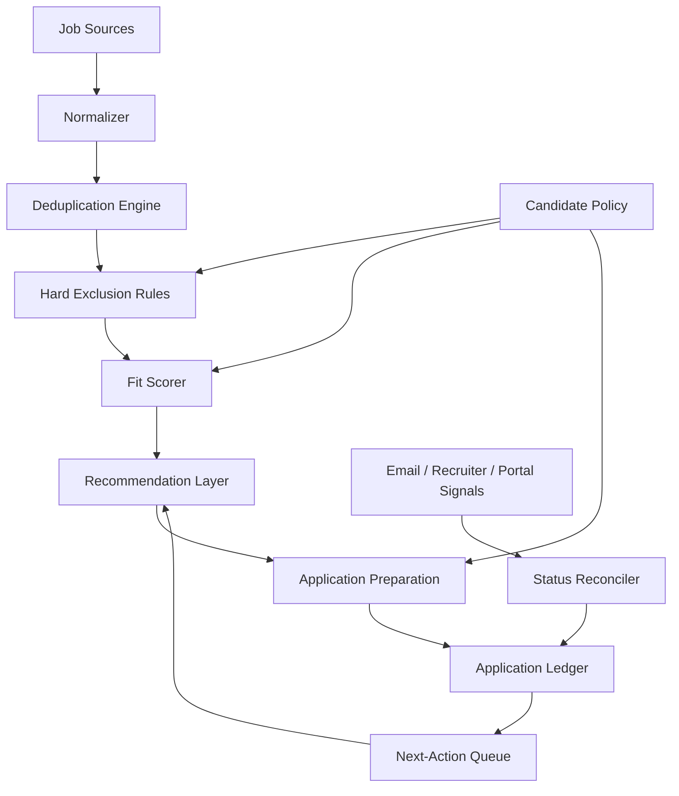

# Architecture

CareerOps separates **deterministic controls** from **model-assisted judgment**.

## Components



## Deterministic layer

The deterministic layer owns decisions that should be explainable and repeatable:

- exact-requisition exclusion
- compensation floor
- location/work-arrangement rules
- clearance constraints
- duplicate detection
- source-authority precedence
- application-state transitions
- weighted score calculation once dimension scores are supplied

## Model-assisted layer

An LLM can assist with:

- extracting structured fields from unstructured postings
- estimating technical and architecture alignment
- identifying risks and missing requirements
- generating concise rationale
- tailoring resume emphasis without changing facts
- interpreting ambiguous recruiter or employer communication

Model output should never bypass deterministic hard exclusions.

## Connector boundary

External integrations should sit behind replaceable adapters:

```text
JobSourceAdapter
CommunicationAdapter
CalendarAdapter
ResumeRenderer
LedgerStore
```

This keeps job boards, employer ATS systems, mail providers, and document-generation implementations replaceable.

## State model

A job and an application are separate entities.

- **Job**: company, title, requisition, source, location, compensation, requirements.
- **Application**: submission date, current status, communication events, deadlines, next action.
- **Status event**: timestamped observation with source and authority level.

This prevents a newly reposted job from overwriting the history of a prior requisition.
